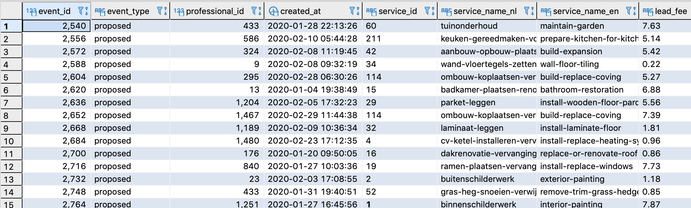
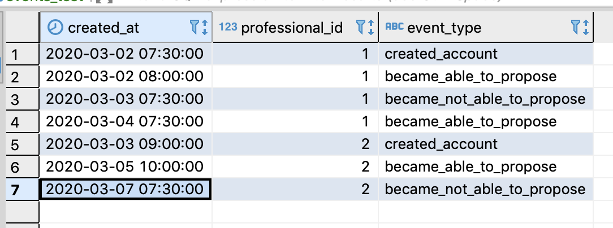
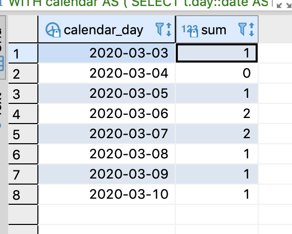

# Werkspot DE Challenge

This project solves the Werkspot Challenge.

# Stack

This projects uses docker-compose to run two Docker images:

- PostgreSQL: This container host an instance of the postgres database to store all the information.
- Python with DBT: This container is in charge to load and process all the information.

# Steps to run it

1. Clone/Fork/Download the repository.
2. Make sure you have `Docker` and `docker-compose`.
3. Execute the PostgreSQL container:
```bash
docker-compose up -d postgres
```
4. Execute the script to ingest and generate the models:
```bash
docker-compose run dev sh bin/provision.sh
```

# How it works?

The `bin/provision.sh` script follow this steps:

1. Pre-process the CSV file, replacing `;` with `,` and sending the output to the `data` folder.
2. The data is inserted into the `raw` schema in the table `events_logs`, using the command `dbt seed`.
3. Two tables are generated, using the command `dbt run`:
- `public.events`: This solves the first question.
- `public.availability_snapshot`: This solves the second question.


# How can I visualize the data?

The PostgreSQL container is exposed in the port 5432, so you can connect to it from your local using the following credentials:
```
host: localhost
port: 5432
user: fake_user
password: fake_password
db: events
```

# Validating results

## First question

In the first question:
- The data was loaded into a denormalized table with no relations since this tables have better performance than a star-schema.
- The meta-data column was exploded into multiple columns for simplicity.

 

## Second question

In the document there is an example of the second question, to validate my code I inserted the same data in another table and executed my SQLs, here are the results:

Test table:



Test Query:

```sql
WITH calendar AS (                                                                                                                                      
SELECT                                                                                                                                                  
    t.day::date AS calendar_day                                                                                                                                 
FROM                                                                                                                                                    
	generate_series(                                                                                                                                    
		(SELECT min(created_at) FROM public.events_test),                                                                                               
		timestamp '2020-03-11', -- Adding an extra day                                                                                                  
		interval '1 day'                                                                                                                                
	) AS t(day)                                                                                                                                         
),                                                                                                                                                      
intermediate_model AS (                                                                                                                                 
select                                                                                                                                                  
	professional_id,                                                                                                                                    
	CASE WHEN event_type IN ('proposed', 'became_able_to_propose') THEN 1 ELSE 0 END AS is_working,                                                     
	created_at,                                                                                                                                         
	LEAD(created_at,1,timestamp '2020-03-10') OVER (PARTITION BY professional_id ORDER BY created_at) AS next_at                                        
FROM                                                                                                                                                    
	public.events_test
),                                                                                                                                                      
final_model AS (                                                                                                                                        
SELECT                                                                                                                                                  
    *,
    row_number() over (partition by professional_id, calendar_day order by created_at desc) as rn
FROM                                                                                                                                                    
    calendar                                                                                                                               
JOIN                                                                                                                                               
    intermediate_model
ON                                                                                                                                                      
    calendar_day>=created_at and calendar_day<=next_at
)                                                                                                                                                       
SELECT calendar_day, sum(coalesce(is_working,0)) FROM final_model where rn=1 group by 1 order by 1
```

Results:



# Where does the code live?

- [Python script](scripts/pre_processing.py)
- [SQL queries](models/events)
